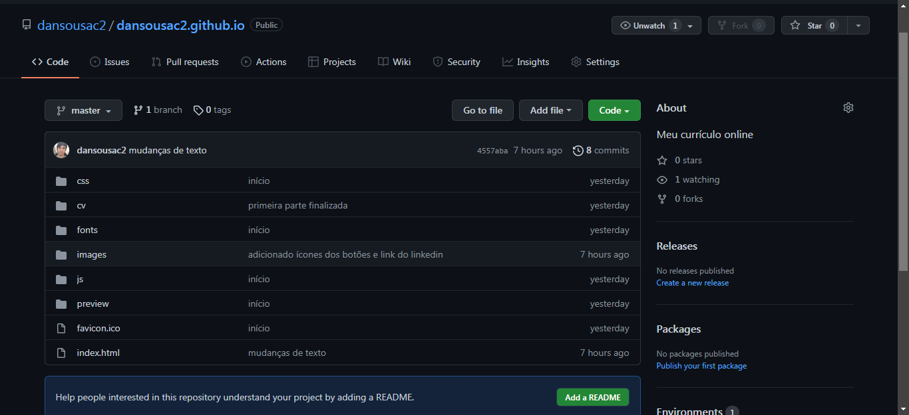

# Meu Currículo Online
> Meu currículo contendo informações profissionais e pessoais

Esse currículo foi criado usando código HTML do curso Geek, premoldado. Tem por finalidade praticar técnicas aprendidas no curso e também, a posteriori, tornar este meu currículo pessoal.

## Instalação
É feita mediante alteração de código disponibilizado pelo curso Geek, juntamente com o Github, sendo este o site hospederio 

## Exemplo de Uso
Através de um repositório no Github é possível armazenar um site estático (um currículo, no nosso caso).

Por meio da edição de partes do código, alteramos a aparência da nossa página web.

## Ambiente de Desenvolvimento
É necessário ter instalado o VSC- Visual Studio Code ou ferramenta similar, juntamente com o Git, estando este vinculado a sua conta do Github.

## Histórico de atualizações
* 1.0
    * RELEASE: primeira versão operacional
* 0.2.1
    * CHANGE: removida a função `setPadraoX()`
    * CHANGE: adicionada a função `inicializar()`

## Meta
Dan Sousa - [Insta](https://instagram.com/dansousa.costa) - [linkedin](https://linkedin.com/dansousac2)

Distribuído sob licença. Veja `LICENÇA`para mais informações.